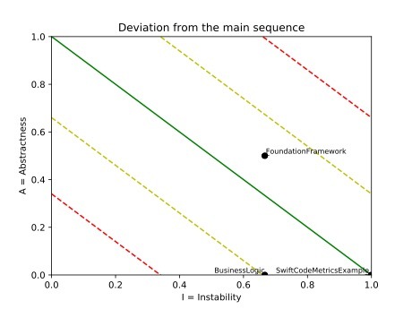
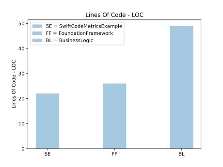
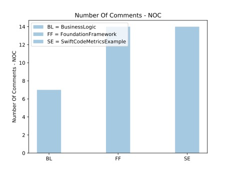
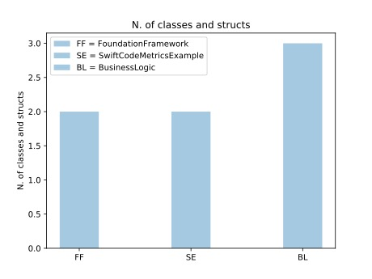
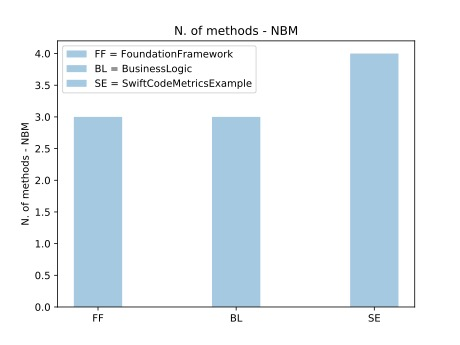
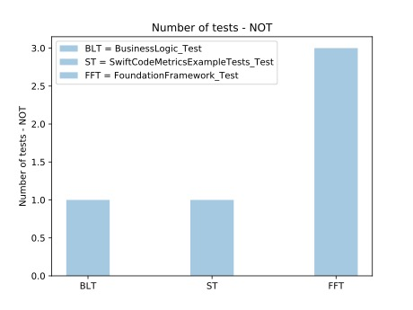
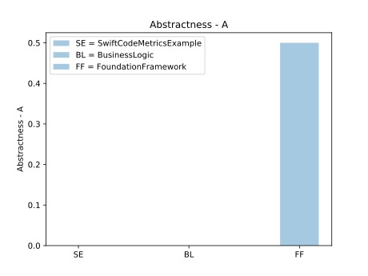
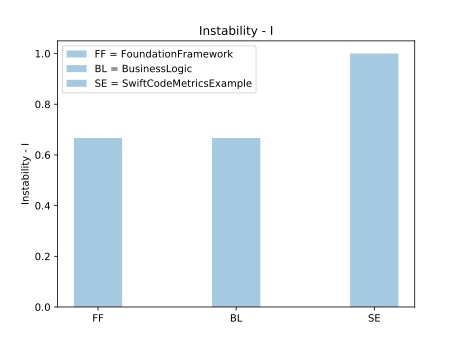

## Guide

How to use `swift-code-metrics`.

## Example project

A sample project is provided in the `resources` folder:

`python3 swift-code-metrics-runner.py --source tests/test_resources/ExampleProject/SwiftCodeMetricsExample --artifacts report --generate-graphs`

### Output format

The `output.json` file will contain the metrics related to all frameworks
and an _aggregate_ result for the project.

The example below is available [here](../tests/test_resources/expected_output.json).

```json
{
    "non-test-frameworks": [
        {
            "BusinessLogic": {
                "loc": 49,
                "noc": 7,
                "poc": 12.5,
                "n_a": 0,
                "n_c": 3,
                "nbm": 3,
                "analysis": "The code is under commented. Low abstract component, few interfaces. ",
                "dependencies": [
                    "UIKit(1)",
                    "FoundationFramework(1)"
                ],
                "not": 0,
                "fan_in": 1,
                "fan_out": 2,
                "i": 0.667,
                "a": 0.0,
                "d_3": 0.333
            }
        },

        ...

    ],
    "tests-frameworks": [
        {
            "BusinessLogic_Test": {
                "loc": 7,
                "noc": 7,
                "poc": 50.0,
                "n_a": 0,
                "n_c": 1,
                "nbm": 1,
                "analysis": "The code is over commented. ",
                "dependencies": [
                    "XCTest(1)"
                ],
                "not": 1
            }
        },

        ...


    ],
    "aggregate": {
        "non-test-frameworks": {
            "loc": 97,
            "noc": 35,
            "n_a": 1,
            "n_c": 7,
            "nbm": 10,
            "not": 0,
            "poc": 26.515
        },
        "tests-frameworks": {
            "loc": 53,
            "noc": 28,
            "n_a": 0,
            "n_c": 4,
            "nbm": 7,
            "not": 5,
            "poc": 34.568
        },
        "total": {
            "loc": 150,
            "noc": 63,
            "n_a": 1,
            "n_c": 11,
            "nbm": 17,
            "not": 5,
            "poc": 29.577
        }
    }
}
```

KPIs legend:

|    Key    |              Metric              |                                             Description                                             |
|:---------:|:--------------------------------:|:---------------------------------------------------------------------------------------------------:|
|   `loc`   |           Lines Of Code          |                            Number of lines of code (empty lines excluded)                           |
|   `noc`   |        Number of Comments        |                                          Number of comments                                         |
|   `poc`   |      Percentage of Comments      |                                       100 * noc / ( noc + loc)                                      |
|  `fan_in` |              Fan-In              | Incoming dependencies: number of classes  outside the framework that depend on classes  inside it.  |
| `fan_out` |              Fan-Out             | Outgoing dependencies: number of classes  inside this component that depend on classes  outside it. |
|    `i`    |            Instability           |                                   I = fan_out / (fan_in + fan_out)                                  |
|   `n_a`   |        Number of abstracts       |                                 Number of protocols in the framework                                |
|   `n_c`   |        Number of concretes       |                            Number of struct and classes in the framework                            |
|    `a`    |           Abstractness           |                                            A = n_a / n_c                                            |
|   `d_3`   | Distance from  the main sequence |                                             D³ = abs( A + I - 1 )                                   |
|   `nbm`   |         Number of methods        |                              Number of `func` (computed `var` excluded)                             |
|   `not`   |          Number of tests         |                      Number of methods in test frameworks starting with `test`                      |

In addition:

|      Key       |                                        Description                                         |
|:--------------:|:------------------------------------------------------------------------------------------:|
|   `analysis`   | Code metrics analysis on the code regarding percentage of comments and components coupling |
| `dependencies` |             List of internal and external dependencies, with number of imports             |


## Graphs

The `--generate-graphs` option will output the following reports:

|                             Components coupling                             |
|:---------------------------------------------------------------------------:|
|                             |
|  Dependency graph, with number of imports of _destination_ from _origin_ .  |
|  |
|                Distance of a library from the ideal domain.                 |

|                                                                                                                                                                     Code distribution                                                                                                                                                                     |
|:---------------------------------------------------------------------------------------------------------------------------------------------------------------------------------------------------------------------------------------------------------------------------------------------------------------------------------------------------------:|
|         |
