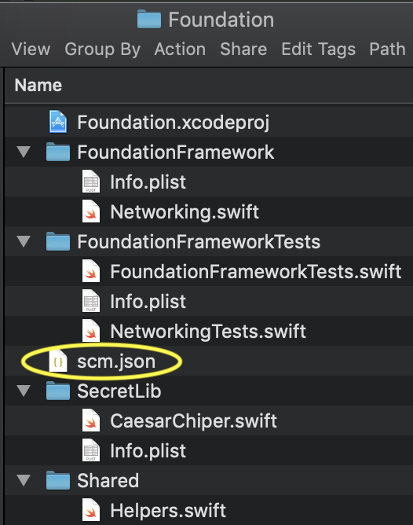
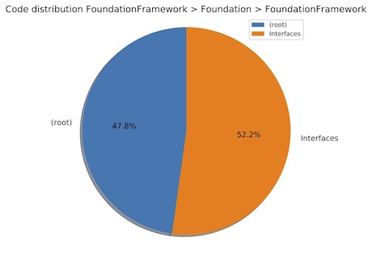

## Guide

A sample project is provided in the `resources` folder:

```bash
python3 swift-code-metrics-runner.py --source swift_code_metrics/tests/test_resources/ExampleProject/SwiftCodeMetricsExample --artifacts report --generate-graphs
```

## Source

The library will start scanning the content under the `source` folder provided. Frameworks will be identified by their 
relative path to the root folder specified, meaning that the file system hierarchy will define the naming convention
(e.g. if a class is under the path `SwiftCodeMetricsExample/BusinessLogic/Logic.swift`, the framework name will be identified
as `BusinessLogic` since `SwiftCodeMetricsExample` is the root of the `source` parameter in the command above).

### Submodules

A Submodule is a folder inside a framework and the library will perform an analysis of the synthetic metrics data for each submodule recursively.
Please make sure that your project folder structure is consistent with your logical groups on Xcode to improve the quality of the analysis
(you can use [synx](https://github.com/venmo/synx) to reconcile groups and local folders). 

### Project paths override

Sometimes the folder structure is not enough to provide a description of the libraries involved, for instance when multiple frameworks are
defined inside the same folder and they are reusing shared code. For these scenarios, it's possible to define a `scm.json` 
file in the root of the custom folder. This file will let `scm` know how to infer the framework structure.

Let's consider the following example:



The `SecretLib` and `FoundationFramework` libraries are both reusing the code in the `Shared` folder and they're both
defined in the same project under the `Foundation` folder. Without an override specification, all of the code inside this
folder will be identifier as part of the `Foundation` framework, which is wrong.

Let's then define the correct structure by adopting this `scm.json` file:

```json
{
  "libraries": [
    {
      "name": "FoundationFramework",
      "path": "FoundationFramework",
      "is_test": false
    },
    {
      "name": "FoundationFrameworkTests",
      "path": "FoundationFrameworkTests",
      "is_test": true
    },
    {
      "name": "SecretLib",
      "path": "SecretLib",
      "is_test": false
    }
  ],
  "shared": [
    {
      "path": "Shared",
      "is_test": false
    }
  ]
}
```
The `libraries` array defines the list of frameworks with their relative path.

The code in the `Shared` folder will contribute to the metrics of every single framework defined in the `libraries` 
array but it will be counted only once for the total aggregate data.

## Output format

The `output.json` file will contain the metrics related to all frameworks
and an _aggregate_ result for the project.

The example below is an excerpt from the example available [here](../swift_code_metrics/tests/test_resources/expected_output.json).

<details>
<summary>Output.json example</summary>

```json
{
    "non-test-frameworks": [
        {
            "FoundationFramework": {
                "loc": 27,
                "noc": 21,
                "poc": 43.75,
                "n_a": 1,
                "n_c": 2,
                "nom": 3,
                "not": 0,
                "noi": 0,
                "analysis": "The code is over commented. Zone of Pain. Highly stable and concrete component - rigid, hard to extend (not abstract). This component should not be volatile (e.g. a stable foundation library such as Strings).",
                "dependencies": [],
                "submodules": {
                    "FoundationFramework": {
                        "n_of_files": 3,
                        "metric": {
                            "loc": 27,
                            "noc": 21,
                            "n_a": 1,
                            "n_c": 2,
                            "nom": 3,
                            "not": 0,
                            "poc": 43.75
                        },
                        "submodules": [
                            {
                                "Foundation": {
                                    "n_of_files": 3,
                                    "metric": {
                                        "loc": 27,
                                        "noc": 21,
                                        "n_a": 1,
                                        "n_c": 2,
                                        "nom": 3,
                                        "not": 0,
                                        "poc": 43.75
                                    },
                                    "submodules": [
                                        {
                                            "FoundationFramework": {
                                                "n_of_files": 2,
                                                "metric": {
                                                    "loc": 23,
                                                    "noc": 14,
                                                    "n_a": 1,
                                                    "n_c": 1,
                                                    "nom": 2,
                                                    "not": 0,
                                                    "poc": 37.838
                                                },
                                                "submodules": [
                                                    {
                                                        "Interfaces": {
                                                            "n_of_files": 1,
                                                            "metric": {
                                                                "loc": 12,
                                                                "noc": 7,
                                                                "n_a": 1,
                                                                "n_c": 0,
                                                                "nom": 1,
                                                                "not": 0,
                                                                "poc": 36.842
                                                            },
                                                            "submodules": []
                                                        }
                                                    }
                                                ]
                                            }
                                        },
                                        {
                                            "Shared": {
                                                "n_of_files": 1,
                                                "metric": {
                                                    "loc": 4,
                                                    "noc": 7,
                                                    "n_a": 0,
                                                    "n_c": 1,
                                                    "nom": 1,
                                                    "not": 0,
                                                    "poc": 63.636
                                                },
                                                "submodules": []
                                            }
                                        }
                                    ]
                                }
                            }
                        ]
                    }
                },
                "fan_in": 1,
                "fan_out": 0,
                "i": 0.0,
                "a": 0.5,
                "d_3": 0.5
            }
        }
    ],
    "tests-frameworks": [
        {
            "BusinessLogic_Test": {
                "loc": 7,
                "noc": 7,
                "poc": 50.0,
                "n_a": 0,
                "n_c": 1,
                "nom": 1,
                "not": 1,
                "noi": 0,
                "analysis": "The code is over commented. ",
                "dependencies": []
            }
        }
    ],
    "aggregate": {
        "non-test-frameworks": {
            "loc": 97,
            "noc": 35,
            "n_a": 1,
            "n_c": 7,
            "nom": 10,
            "not": 0,
            "noi": 2,
            "poc": 26.515
        },
        "tests-frameworks": {
            "loc": 53,
            "noc": 28,
            "n_a": 0,
            "n_c": 4,
            "nom": 7,
            "not": 5,
            "noi": 0,
            "poc": 34.568
        },
        "total": {
            "loc": 150,
            "noc": 63,
            "n_a": 1,
            "n_c": 11,
            "nom": 17,
            "not": 5,
            "noi": 2,
            "poc": 29.577
        }
    }
}
```
</details>

KPIs legend:

|    Key    |              Metric              |                                             Description                                             |
|:---------:|:--------------------------------:|:---------------------------------------------------------------------------------------------------:|
|   `loc`   |          Lines Of Code           |                           Number of lines of code (empty lines excluded)                            |
|   `noc`   |        Number of Comments        |                                         Number of comments                                          |
|   `poc`   |      Percentage of Comments      |                                      100 * noc / ( noc + loc)                                       |
| `fan_in`  |              Fan-In              | Incoming dependencies: number of classes  outside the framework that depend on classes  inside it.  |
| `fan_out` |             Fan-Out              | Outgoing dependencies: number of classes  inside this component that depend on classes  outside it. |
|    `i`    |           Instability            |                                  I = fan_out / (fan_in + fan_out)                                   |
|   `n_a`   |       Number of abstracts        |                                Number of protocols in the framework                                 |
|   `n_c`   |       Number of concretes        |                            Number of struct and classes in the framework                            |
|    `a`    |           Abstractness           |                                            A = n_a / n_c                                            |
|   `d_3`   | Distance from  the main sequence |                                        D³ = abs( A + I - 1 )                                        |
|   `nom`   |        Number of methods         |                             Number of `func` (computed `var` excluded)                              |
|   `not`   |         Number of tests          |                      Number of methods in test frameworks starting with `test`                      |
|   `noi`   |        Number of imports         |                                    Number of imported frameworks                                    |

In addition:

|      Key       |                                        Description                                         |
|:--------------:|:------------------------------------------------------------------------------------------:|
|   `analysis`   | Code metrics analysis on the code regarding percentage of comments and components coupling |
| `dependencies` |             List of internal and external dependencies, with number of imports             |


## Graphs

The `--generate-graphs` option will output the following reports:

### Components coupling

#### Dependency graph


Dependency graph with number of imports of _destination_ from _origin_.

The framework width and border size are directly proportional to the framework's LOC percentage compared to the total LOC. The thickness of the connection arrow between two frameworks is directly proportional to the percentage of imports call compared to the total number of imports.

The tool will generate also the _external dependencies graph_ (which will represent the coupling of the source code with external libraries) and the _aggregate dependencies graph_ (which will aggregate both internal and external dependencies).

#### Distance from main sequence


It express the components coupling in terms of stability and abstraction.

Ideally, components should be close to the ideal domain (in green) and the most distant areas are identified as _zones of pain_ (in red).
A framework with I < 0.5 and A < 0.5 indicates a library that's rigid to change, usually a foundation component. Instead, with I > 0.5 and A > 0.5, it's possible to identify components with few dependents that's easy to change, usually representing a container of leftovers or elements still being fully developed.

For a more detailed description, please refer to the _Clean Architecture, Robert C. Martin_ book, Chapter 14 _Component Coupling_.

### Code distribution

      
