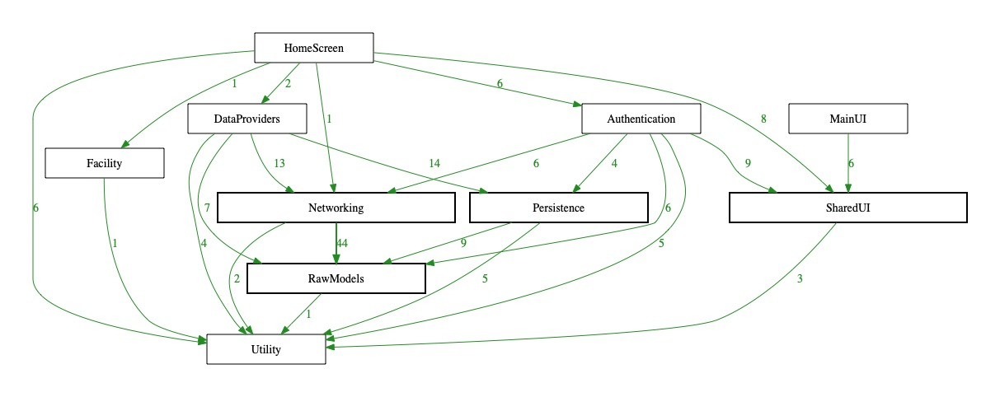
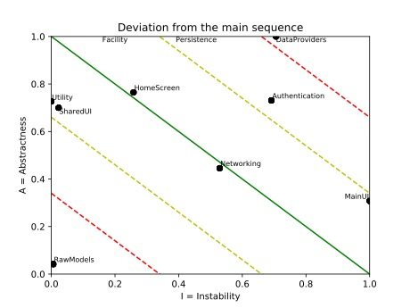
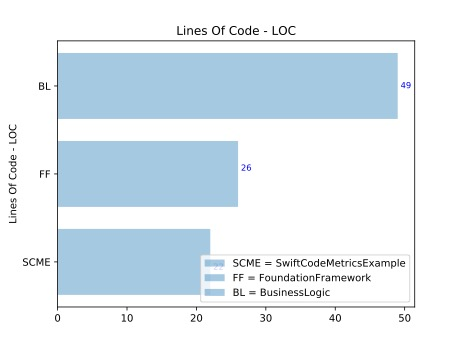
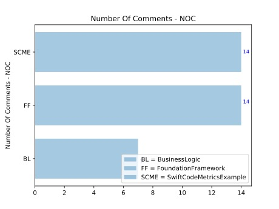
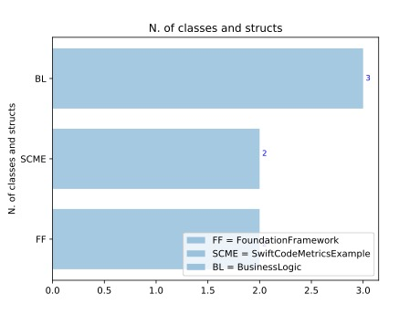
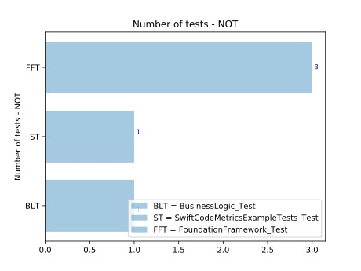
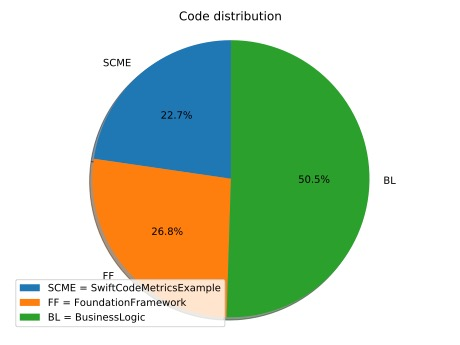

## Guide

A sample project is provided in the `resources` folder:

`python3 swift-code-metrics-runner.py --source swift_code_metrics/tests/test_resources/ExampleProject/SwiftCodeMetricsExample --artifacts report --generate-graphs`

### Output format

The `output.json` file will contain the metrics related to all frameworks
and an _aggregate_ result for the project.

The example below is an excerpt from the example available [here](../swift_code_metrics/tests/test_resources/expected_output.json).

```json
{
    "non-test-frameworks": [
        {
            "BusinessLogic": {
                "loc": 49,
                "noc": 7,
                "poc": 12.5,
                "n_a": 0,
                "n_c": 3,
                "nbm": 3,
                "not": 0,
                "noi": 1,
                "analysis": "The code is under commented. Zone of Pain. Highly stable and concrete component - rigid, hard to extend (not abstract). This component should not be volatile (e.g. a stable foundation library such as Strings).",
                "dependencies": [
                    "FoundationFramework(1)"
                ],
                "fan_in": 1,
                "fan_out": 1,
                "i": 0.5,
                "a": 0.0,
                "d_3": 0.5
            }
        }
    ],
    "tests-frameworks": [
        {
            "BusinessLogic_Test": {
                "loc": 7,
                "noc": 7,
                "poc": 50.0,
                "n_a": 0,
                "n_c": 1,
                "nbm": 1,
                "not": 1,
                "noi": 0,
                "analysis": "The code is over commented. ",
                "dependencies": []
            }
        }
    ],
    "aggregate": {
        "non-test-frameworks": {
            "loc": 97,
            "noc": 35,
            "n_a": 1,
            "n_c": 7,
            "nbm": 10,
            "not": 0,
            "noi": 2,
            "poc": 26.515
        },
        "tests-frameworks": {
            "loc": 53,
            "noc": 28,
            "n_a": 0,
            "n_c": 4,
            "nbm": 7,
            "not": 5,
            "noi": 0,
            "poc": 34.568
        },
        "total": {
            "loc": 150,
            "noc": 63,
            "n_a": 1,
            "n_c": 11,
            "nbm": 17,
            "not": 5,
            "noi": 2,
            "poc": 29.577
        }
    }
}
```

KPIs legend:

|    Key    |              Metric              |                                             Description                                             |
|:---------:|:--------------------------------:|:---------------------------------------------------------------------------------------------------:|
|   `loc`   |          Lines Of Code           |                           Number of lines of code (empty lines excluded)                            |
|   `noc`   |        Number of Comments        |                                         Number of comments                                          |
|   `poc`   |      Percentage of Comments      |                                      100 * noc / ( noc + loc)                                       |
| `fan_in`  |              Fan-In              | Incoming dependencies: number of classes  outside the framework that depend on classes  inside it.  |
| `fan_out` |             Fan-Out              | Outgoing dependencies: number of classes  inside this component that depend on classes  outside it. |
|    `i`    |           Instability            |                                  I = fan_out / (fan_in + fan_out)                                   |
|   `n_a`   |       Number of abstracts        |                                Number of protocols in the framework                                 |
|   `n_c`   |       Number of concretes        |                            Number of struct and classes in the framework                            |
|    `a`    |           Abstractness           |                                            A = n_a / n_c                                            |
|   `d_3`   | Distance from  the main sequence |                                        D³ = abs( A + I - 1 )                                        |
|   `nbm`   |        Number of methods         |                             Number of `func` (computed `var` excluded)                              |
|   `not`   |         Number of tests          |                      Number of methods in test frameworks starting with `test`                      |
|   `noi`   |        Number of imports         |                                    Number of imported frameworks                                    |

In addition:

|      Key       |                                        Description                                         |
|:--------------:|:------------------------------------------------------------------------------------------:|
|   `analysis`   | Code metrics analysis on the code regarding percentage of comments and components coupling |
| `dependencies` |             List of internal and external dependencies, with number of imports             |


## Graphs

The `--generate-graphs` option will output the following reports:

### Components coupling



Dependency graph, with number of imports of _destination_ from _origin_.
The framework width and border size are directly proportional to the framework's LOC percentage compared to the total LOC. The thickness of the connection arrow between two frameworks is directly proportional to the percentage of imports call compared to the total number of imports.



It express the components coupling in terms of stability and abstraction.

Ideally, components should be close to the ideal domain (in green) and the most distant areas are identified as _zones of pain_ (in red).
A framework with I < 0.5 and A < 0.5 indicates a library that's rigid to change, usually a foundation component. Instead, with I > 0.5 and A > 0.5, it's possible to identify components with few dependents that's easy to change, usually representing a container of leftovers or elements still being fully developed.

For a more detailed description, please refer to the _Clean Architecture, Robert C. Martin_ book, Chapter 14 _Component Coupling_.


|                                                                                                        Code distribution                                                                                                         |
|:--------------------------------------------------------------------------------------------------------------------------------------------------------------------------------------------------------------------------------:|
|       |
